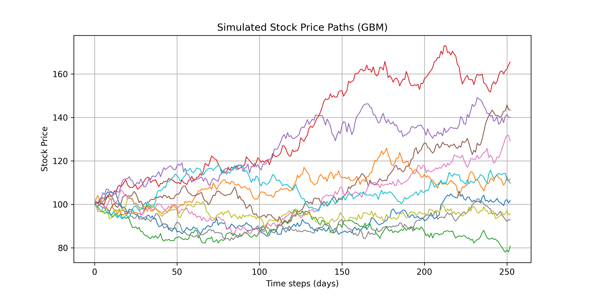

# Monte Carlo Option Pricing Simulation

This project implements a Monte Carlo simulation to price European call options using Geometric Brownian Motion to model stock price paths. It includes:

- Simulation of multiple stock price trajectories
- Calculation of option payoffs and fair price estimation
- Visualization of stock paths and payoff distributions

## Visuals

### Simulated Stock Price Paths

